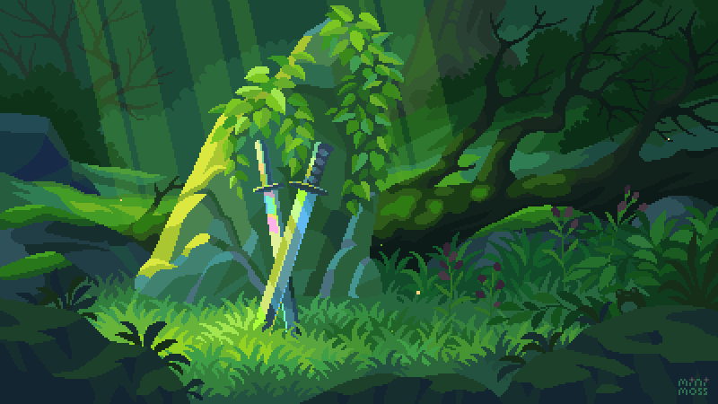

# Romy's Portfolio 👩‍💻

 

A modern, responsive portfolio website built with React, Tailwind CSS, and Framer Motion animations, powered by Bun.

## 🌟 Features

- **Modern UI/UX** - Clean, responsive design with dark mode aesthetics
- **Smooth Animations** - Powered by Framer Motion
- **Interactive Elements** - Hover effects and scroll animations
- **Functional Contact Form** - Integrated with EmailJS
- **Performance Optimized** - Fast loading with Bun
- **Responsive Design** - Works on all device sizes

## 🛠 Technologies Used

- **Frontend**: React 18
- **Styling**: Tailwind CSS
- **Animations**: Framer Motion
- **Icons**: React Icons
- **Form Handling**: EmailJS
- **Runtime**: Bun
- **Deployment**: Vercel/Netlify

## 🚀 Getting Started

### Prerequisites
- [Bun](https://bun.sh/) (v1.0.0 or higher)
- Node.js (optional, if not using Bun)

###  Project Structure
my-app/
|
├── public/               #assets

├── src/

│   ├── components/       # React components

│   │   ├── Navbar/

│   │   ├── Hero/

│   │   ├── About/

|   |   ├── LearningJourney/

│   │   ├── Skills/

│   │   ├── Projects/

│   │   ├── Podcast/

|   |   ├── Stats/

│   │   └── Contact/

│   ├── App.jsx           # Main App component

|   ├── main.jsx

│   └── App.css        

├── bun.lock          

├── eslint.config.js

├── index.html

├── package.json

├── vite.config.js

├── tailwind.config.js    # Tailwind CSS config

└── postcss.config.js     # PostCSS config

### 📄 License
This project is licensed under the MIT License - see the LICENSE file for details.

### ✨ Acknowledgments

- Bun for the fast JavaScript runtime

- Tailwind CSS for utility-first CSS

- Framer Motion for animations

- React Icons for beautiful icons

## Made with ❤️ by Romy (Xiao Ro) 
